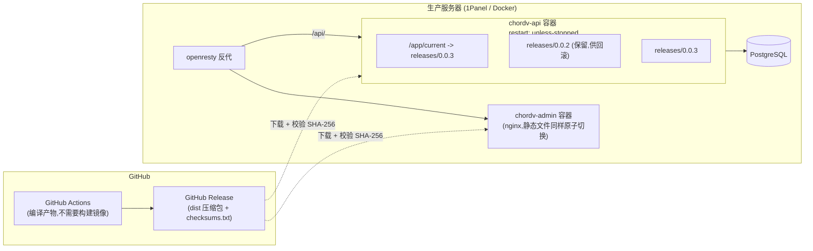
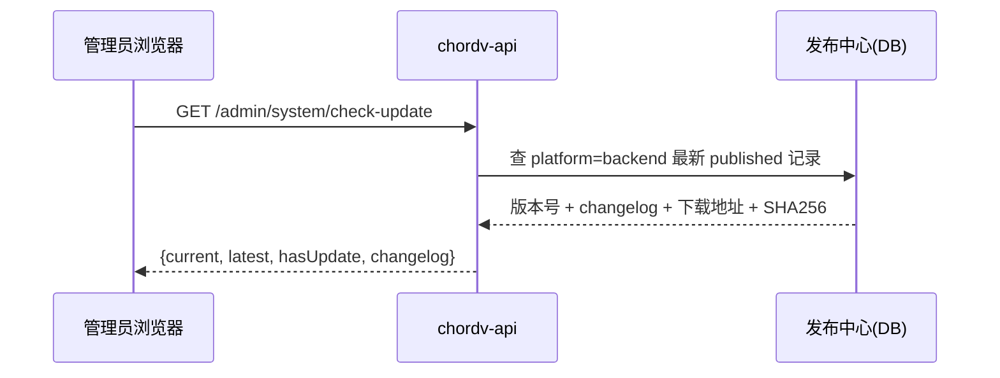

# PRD：ChordV 后台系统一键更新

状态：**草稿 v0.3，待确认事项已全部拍板** ｜ 创建日期：2026-09-04 ｜ 负责人：待定

> v0.2 变更：根据反馈简化架构——去掉独立的 `chordv-updater` 组件和 docker-socket-proxy，改为"容器内原子文件替换 + 进程自退出 + Docker 原生重启策略接管"，不再需要额外的镜像仓库。第 14 节的待确认事项 1/2/3/5 已确认。
>
> v0.3 变更：确认服务器为国内节点，用加速镜像访问 GitHub（如 `https://ghfast.top/`）。发现仓库里已有现成的全局加速镜像机制（`DownloadMirrorService`，与发布中心、运行时组件共用），直接复用即可，不新增任何下载基础设施，见 4.4 节。第 14 节待确认事项全部解决。
>
> v0.4 变更（实现阶段）：见下方「实现说明」——在 4.1「应用自己切软链接后退出」之外，落地时增加了一个**容器内进程外监督者**（`deploy/1panel/chordv/entrypoint.sh`），由它负责“提升新版本 → 健康门控 → 失败自动回滚”，这样 6.3 的“健康检查不过自动回滚”才真正有一个活着的角色去执行（应用自己退出后无法给自己做健康门控）。检查更新的数据源也从 `api.github.com` 调整为 raw manifest（ghfast 可代理，`api.github.com` 不可）。

---

## 0. 实现说明（v0.4，随开发更新）

落地时相对 4.1/6.2/6.3 的调整（以下早期说明需以代码和最新评审补充为准）：

**第40轮补充：限时后台工作统一走预算窗口，禁止 race 已登记任务。** `Promise.race([workLifecycle.track(task), timeoutTask])` 看似等价，实则超时返回后工作项仍持有到底层 promise 结算：一个挂死的远端调用（例如不可达的 3x-ui 面板）会把排空拖到该调用自己的 socket 超时。**预算窗口只有在被放弃的工作另有所有者时才合法**（重试队列会重跑、后台日志会记录）：远端读、探测、幂等清理属于这一类，共 16 处已改为 `awaitWithBudget`（到期抛可辨识的 `WorkBudgetExceededError`，按**实例身份**判定——嵌套预算抛的是同一个类，用 `instanceof` 会把内层到期当成自己到期，吞掉任务失败并按未到期的外层超时值打日志）或 `awaitWithBudgetElse`（到期跑**惰性**兜底并返回其值，类型为任务与兜底的联合，与 race 语义一致；任务自身失败仍向上抛）。预算只覆盖**等待窗口**，到期即释放登记，未结算的操作交还其所有者。

**反例同样重要：本身就在创建持久记录的工作没有所有者，必须保持登记。** 面板同步入队、租约撤销入队、面板禁用入队、节点保存后的续作（`queuePanelAccessSyncForNodeSubscription`、`withNodePanelBindingSubscriptionBudget`、`runAfterLocalNodeSaveWithBudget`、`tryRunAfterLocalNodeSave`、`withSubscriptionFollowUpBudget`）若在预算到期时释放登记，自更新可能在入队落盘前关闭 Prisma 并退出，本地改动就留下没有对应面板同步的状态。这 5 处保持原样跟踪；它们都是**本地 DB 入队**，排空等的是数据库而非打不通的面板，因此不重新引入远端挂死那一类风险。彻底解法是「先落盘重试记录、再限时等待」，另开 PR 处理。计时器保持 referenced（unref 可能丢掉唯一句柄导致超时永不触发）。`system-update-shutdown.regression.ts` 增加源码断言：race 已登记任务的写法按**带说明的例外清单**核对（上述 5 处，注明原因），清单**只能减不能增**——在已允许的文件里再加一处也会失败。

**第39轮补充：长连接与定时任务必须响应排空。** Agent 命令流（`/api/agent/v1/events`）是长驻 SSE 请求，在线 Agent 不会主动断开：它的请求工作项和 HTTP 服务器关闭因此永不释放，面板触发的更新每次都被拖到排空超时并围栏——这是三次面板更新全部失败、随后只能手工提升的直接原因。所有长连接流必须与管理端/客户端 SSE 一致，注册 `workLifecycle.onDrain(() => subscriber.complete())` 并在退订时移除该监听；Agent 命令重试定时任务补 `@DrainableJob()`，排空期间不再领取新的命令作业。新增任何长连接或定时任务时必须同时接入这两个契约，并在 `system-update-shutdown.regression.ts` 中断言其订阅在排空开始后已完成。

**第38轮补充：签名渠道、历史清理与收尾状态。** 发布工作流将channel（stable/prerelease）写入清单后再签名；API签名模式只接受显式stable渠道，先验证渠道再推进防重放阈值。发布资产校验要求渠道与Release类型一致，稳定源发布拒绝prerelease或缺失渠道的传入资产；读取GitHub已有旧稳定清单做升级比较时仍可识别缺失渠道的历史记录。没有渠道字段的旧签名资产不能通过新API或恢复校验，应发布带渠道的新版本，禁止修改/重签原不可变资产。

历史目录清理移至监督者：仅在前向更新健康稳定、结果持久化且当前进程已批准后执行，清理期间promoting仍阻止竞争更新；保留当前版及前一个健康版，再按原SemVer顺序满足保留数量。暂存、失败更新、重启及回滚都不清理历史，删除失败仅告警并保留剩余目录。API不再保留第二套清理逻辑。前端收到终态后进入finishing并清除旧检查结果，等待运行版本、清单、历史刷新完成才解除忙碌状态。

**第37轮补充：持久化故障与业务准入。** 快照内容/发布/复用同步失败均拒绝迁移；提升日志、目标指针、结果、健康指针的同步错误向调用方传播，恢复日志在再次交接前也需同步成功。API目录fsync仅对明确不支持的EINVAL/ENOTSUP/EOPNOTSUPP记录警告，其余I/O与权限错误拒绝持久写入；同值阈值再次接受前也同步目录，避免上次rename可见但fsync失败被读回绕过。明确不支持目录fsync的平台不具备同等掉电持久性保证。

监督者为每次进程启动生成新的随机批准令牌，健康门控、稳定期及必要终态记录完成后才原子发布本进程令牌。候选API在body parser/业务路由前只允许GET/HEAD健康端点，其余请求返回503；DrainableJob定时批次与附件清理同样等待批准。批准文件缺失、不可读或令牌不匹配均不放行业务；旧文件不能批准新进程。令牌只用于存活进程的一次性准入，不作为跨重启的恢复日志，重启总要重新批准。启动必要的数据库初始化/迁移、审计协调不属于业务请求准入；旧版未实现此协议的应用不自动获得相同隔离能力，生产需部署匹配的新API代码及监督者镜像。

**第32轮补充：快照开关与长操作跟踪。** API与监督者对 `CHORDV_SYSTEM_UPDATE_SNAPSHOT` 使用相同的严格语义：去掉首尾空白、不区分大小写，true/1/yes/on为启用，false/0/no/off为明确停用，未设置或空白默认启用；其他值在启动及快照入口拒绝，不能因拼写错误跳过恢复点。前端不再使用40分钟失联或90分钟绝对时限推断操作完成；已知pending/running继续跟踪，失联或操作暂不可见时保留忙碌状态并按6/12/24/30秒退避（上限30秒），恢复联系后回到3秒间隔。只有确认succeeded/failed/rolled_back才恢复控制；卸载或更换跟踪操作停止调度，网络请求沿用60秒超时。无明确终态时需检查服务与状态，不能由前端自行宣称完成。

**第31轮补充：重启版本语义与SSE代理。** restart失败时保留请求版本并记录failed及持久恢复禁令，不能借历史健康版本自动降级；管理员核对原因后按离线恢复流程处理。前驱回滚仅用于update/rollback的恢复。admin与外层OpenResty代理均显式 `proxy_buffering off`，保证每层持续转发SSE事件，不依赖可能被上一层消费的 `X-Accel-Buffering` 响应头。代理配置变更需更新对应容器/面板配置后才在生产生效。

**第29轮补充：发布中断的回滚指针与清单读取。** 更新私有last-good前，先将不同的原健康版本持久化至私有 `last-good-version.previous`；同版本发布重试不会覆盖前驱。公开版本标记发布失败并重启后，若候选已成为私有last-good但健康检查失败，仍可选择此前驱回滚；回滚落地失败禁止再次跳回原失败候选。镜像清单读取按配置顺序逐个尝试所有换行/逗号分隔前缀，去重后最后直连；未签名模式保持HTTPS直连。readiness从当前执行模块所属的 `@chordv/api` package.json定位迁移根目录，不再依赖启动工作目录，包元数据缺失/不可读仍拒绝检查。

**第28轮补充：健康截止时间与终态清理。** 健康超时按实际已用秒数计算，并将每次curl超时限制为剩余预算（最多3秒），不再把慢探针耗时排除在计时之外；配置仅接受1..86400秒的十进制正整数。终态最后的promoting标记移除及同步失败时保留代际上下文、每2秒重试，清理成功前不标记监督者完成；结果一旦持久化，在同一进程的清理重试期间不重复发布，避免重新生成已被API消费的结果。私有/公开运行目录的Git忽略规则保持原语义，集中分组展示以便审阅。

**第27轮补充：启动关闭与网页入口切换。** HTTP server 尚未监听时，Node返回的 `ERR_SERVER_NOT_RUNNING` 仅表示监听器已关闭，不视为排空失败；仍等待已登记工作，其余关闭错误继续拒绝完成。admin网页入口改为同目录临时软链接加GNU `mv -fT` 原子替换，读者只能见到旧入口或新入口；准备/替换失败保留旧入口，首次失败退出，运行期间失败不推进当前版本记录并在下轮重试。本实现依赖现有bookworm镜像的GNU mv，不改变页面布局。

**第26轮补充：恢复点复用与稳定期配置。** 同一操作复用已完成快照前，重新进行限时 `gzip -t` 完整性检查；空文件、损坏、截断或无法完成验证时保留原文件并拒绝迁移，不自动用可能已迁移数据库的新快照替换原恢复点。稳定期 `CHORDV_SYSTEM_UPDATE_STABILIZE_SECONDS` 仅接受1..86400秒的十进制正整数，默认10秒；0、负数、小数、非数字、前导零及超范围在启动时即拒绝，早于版本提升或迁移。此处验证压缩完整性，不等于真实数据库恢复演练。

**第25轮补充：版本阈值损坏与停止宽限期。** 签名清单防重放记录仅在读取返回 ENOENT 时视为尚未建立；空白、非法/非规范 SemVer 或其他读取错误一律拒绝本次检查，保留原文件供人工修复，不用旧清单覆盖阈值。Compose API 的 `stop_grace_period` 固定为32分钟，覆盖排空硬上限30分钟、Nest关闭钩子30秒并留出监督者余量；显式命令超时覆盖、宿主机关机期限或强杀仍可能缩短该窗口。此配置需重新创建容器才生效。后台仅允许无warning、非cached且检查完成的更新结果发起更新；入口和确认按钮共用此条件，刷新请求异常清除旧检查结果。版本详情和原有告警保持展示，管理员可重新检查更新后继续。

**第24轮补充：快照权限与失败进程关闭。** 创建或复用快照前，将独立备份目录收紧为 `0700`；通过 `mktemp` 和局部 `umask 077` 创建 `0600` 的临时快照，原子发布后权限不变，复用旧快照前同样收紧为 `0600`。权限设置失败拒绝快照和迁移。`CHORDV_SYSTEM_UPDATE_SNAPSHOT_KEEP` 仅接受 1..999999 的十进制整数，无效值在创建/复用快照前拒绝，不能删除唯一恢复点后继续迁移。旧部署已有备份在下一次快照操作前仍须由管理员检查并收紧宿主机目录和文件权限；本轮不会扫描其他目录或自动修改生产文件。

失败候选在健康门控失败后，收到 SIGTERM 最多等待 `CHORDV_SYSTEM_FAILED_STOP_TIMEOUT_SECONDS`（默认30秒，可设1..999秒）；仍存活时先持久化失败恢复决定，再发送 SIGKILL，最多再等5秒确认退出。确认退出后才进入原有健康门控回滚；无法记录决定或无法确认退出则监督者退出非零，交由容器停止并保留日志，绝不在候选仍运行时启动 fallback。强杀不能保证外部副作用回滚，也不恢复数据库；正常宿主机/容器停止流程仍保持原有排空行为。

**第23轮恢复补充：** `pending.json` 向 `promoting.json` 交接写盘失败时，监督者保留原始暂存日志，每 2 秒重试，期间不启动应用；修复存储后继续同一操作，TERM/INT 可停止重试，监督者重启仍从日志恢复。若交接已完成但暂存日志未删除，重启只清理字段完全匹配的重复日志；不匹配则保留两份日志并停止，需离线检查。已开始提升的目标目录丢失时，保留原操作目标与迁移风险标记，持久化失败决定及结果并保留启动禁令；不能把旧代码自动启动在可能变化的数据库上。恢复按第19轮补充中的离线恢复步骤进行，代码目录恢复本身不解除禁令。

**第22轮补充：交接日志必须完整有效。** 启动恢复及应用退出后的 `pending.json` / `promoting.json` 通过真正 JSON 解析并一次性校验：安全的 SemVer、非空安全 operationId、明确的 update/rollback/restart 类型及显式布尔 `migrationApplied`；缺失字段不再兼容解释为 false。可选 rollbackFrom/failureVersion/failureReason 必须类型正确且恢复语义一致。损坏、截断、非普通文件、悬空链接或不可读日志原样保留，监督者退出非零，在迁移、提升、启动、丢弃版本或编造操作结果之前停止；有效字段持于内存，不再以宽松文本提取反复读取。遇到阻断应停机、归档原日志、核对实际数据库及操作历史后人工修复，不能通过删标记或补一个猜测的 migrationApplied 绕过快照和恢复门控。

**第22轮补充：备份与 admin 文件系统隔离。** 数据库快照改为 API 独占的 `./api-backups:/app/backups`；compose 固定 `CHORDV_SYSTEM_UPDATE_BACKUP_DIR=/app/backups`（覆盖旧 `.env`），镜像、监督者及运行时配置默认保持一致。admin 不再挂载私有 `api-state`，改为只读挂载独立 `api-public-state` 到 `/usr/share/nginx/public-state`；API 在 `/app/public-state` 中仅原子发布通过健康门控的 `last-good-version`，且须先提交私有 last-good，公开写入失败阻止终态确认并重试。既有 `api-state/backups` 因整卷不再给 admin 而立即被隔离，不自动移动/删除；迁移应停机、保留原件、管理员专用归档、校验压缩完整性/SHA-256并验证恢复，勿将旧备份复制至公开标记或 releases。三个目录必须真实独立；直接 docker run/自定义覆盖文件需自行维持该边界。本次为 compose/镜像修复，必须重建 api/admin 容器，应用内更新或单纯 restart 不生效；保留现有 `.env` 和密钥。具体命令、保留策略和检查项见 README 的「旧部署升级与快照迁移」。此边界防止 nginx 读取新旧数据库快照，不隔离 API、Docker 管理员或宿主机权限。

**第18轮补充：迁移失败后的恢复边界。** 自动/手动回滚落地跳过 `migrate deploy`，但仍须通过 readiness 与稳定期；部分 DDL 可能使旧代码也无法健康上线，代码回滚不等于数据库恢复。回滚终态确认后，普通应用/容器重启仍会按启动流程运行迁移；未处理的 Prisma 失败迁移记录可能再次触发 P3009。管理员应在再次重启或更新前检查失败迁移并按迁移前快照恢复/人工修复，不能把代码回滚视为迁移历史已修复。快照默认从 DATABASE_URL 移除 Prisma 专属参数；使用连接池或需独立直连时可配置 `CHORDV_SYSTEM_UPDATE_SNAPSHOT_DATABASE_URL`（应指向同一数据库）。

**第20轮补充：真实结构探测。** readiness 除连接和迁移历史外，通过当前发布生成的 Prisma DMMF 对全部模型的 scalar/enum 列执行映射感知、只读 `SELECT … LIMIT 0`，即使空表也会拒绝被新版迁移删除/改名的旧版所需表列。探测不读取业务记录，错误对外统一为503。第21轮进一步为完整 readiness 校验（连接、迁移、结构）添加进程内 singleflight 和完成后5秒的成功/失败缓存；并发及错误请求不会各自触发查询，过期后等待新检查而不返回旧成功。新启动/回滚进程不复用旧进程缓存。健康恶化或恢复的可见性最多受剩余5秒缓存窗口影响；liveness仍不访问数据库。此探测只证明表/列可选择，不证明类型、写约束、枚举值或全部业务语义兼容，破坏性迁移仍需人工恢复方案。

**第19轮补充：无可用回滚版本时停止推进。** 提升失败且 last-good 缺失、不可用或与候选相同，监督者保留带 `failureVersion` 的 `promoting.json` 作为持久启动禁令，记录失败后退出非零。容器重启仍会遵守禁令，不把失败候选当普通启动、也不绕过快照门控。修复快照依赖本身不会自动重新执行原失败操作。此异常需离线恢复：停止容器，检查/修复数据库和快照原因，按修复后的版本及迁移要求准备带新 operationId 的 pending 操作，再移除旧 promoting 禁令后启动；保留旧失败结果供审计。不得仅删除禁令便直接启动原候选。

**第19轮补充：排空后再交接。** 自更新/回滚/重启不再固定等待 600ms 直接退出，而是停止新 HTTP/定时工作、完成只读 SSE、等待请求体和实际处理器及已登记后台任务结束，再执行 Nest 关闭钩子。排空默认 12 分钟，可用 `CHORDV_API_DRAIN_TIMEOUT_MS` 配置，最高 30 分钟；关闭钩子另限 30 秒。pending 标记仅在上述步骤成功且专属 PG 锁仍有效后写入。超时、钩子失败或锁丢失时，失败结果先经独立持久化标记记录（写入失败单独记录错误）并撤销未完成的 pending 意图，随后**退出进程（码 1）交由监督者重启同版本**——监督者的重启走完整 readiness + 稳定期门控，服务自动恢复；仅"pending 意图撤销失败"保留围栏等待人工（残留标记绝不能驱动一次提升）。**信号取消**（第二次 TERM/INT 中断排空）同样保留围栏：那是操作者的主动中断，进程交由监督者的停止流程处置，退出会把主动中断变成一次计划外的同版本重启。限时后台工作（面板同步重试、租约撤销效果、公告/工单后台续作、用量同步远端调用）按**预算窗口**计入工作登记：预算到期即释放登记，未结算的远端操作交还重试队列或后台日志，不再占用排空等待——一个挂死的远端调用曾把三次面板触发的更新全部拖到排空超时。此机制为单进程显式工作登记；后续新增脱离请求的工作必须接入 work-lifecycle（限时续作用 `awaitWithBudget` 或等价的 enter/leave 窗口），不能防护外部 SIGKILL/OOM。

1. **进程外监督者（entrypoint.sh）**：应用执行“下载→校验→解压→检查待迁移项→停止接单并排空工作→Nest 关闭→写 `state/pending.json`→退出”。监督者在旧应用退出后接管提升、按操作隔离的迁移前快照、迁移和启动；回滚落地跳过迁移。readiness 探测与稳定期通过后才更新 `last-good-version`。Docker 的 `restart: unless-stopped` 是监督者自身退出后的兜底。
2. **监督者确认终态**：成功、失败和自动回滚均由监督者写 `state/operation-result.<operationId>.json`；应用启动及状态轮询时消费落库。新应用仅启动并不自证成功，自动回滚必须等 fallback 自身健康后才写 rolledback；结果落盘失败保留上下文重试。
3. **检查更新数据源 = raw manifest**：`api.github.com` 加速镜像不可达（实测 ghfast 对它返回 403），改为拉一个发布在 raw 上的 `manifest.json`（版本号 + 产物 URL + SHA-256 + changelog），加速镜像可代理；校验用的 SHA-256 以 manifest 记录为准（详见 11 节安全边界，仍不采信代理返回内容）。
4. **发布单元 = api + admin 同一个 release**：release 压缩包内含 `apps/api/dist` 与 `apps/admin/dist`；admin 容器（nginx）只读挂载共享的 releases/public-state 卷（绝不挂载私有 state/backups），网页根指向“当前版本”的 `apps/admin/dist`，api 自更新切版本后 admin 随之跟随（`admin-entrypoint.sh` 仅跟随通过健康门控的 last-good-version 重指向 + reload），admin 侧无需任何更新逻辑。
5. **打包/运行踩坑（实构建实跑修正）**：(a) 构建阶段需装 `openssl` 且 Prisma 需显式 `binaryTargets`（`debian-openssl-3.0.x` / `linux-arm64-openssl-3.0.x`），否则生成的引擎与 bookworm 运行时（openssl 3.0.x）不匹配；(b) 运行镜像需 `postgresql-client-16`（迁移前 `pg_dump` 快照，须匹配 PG16）+ `curl/tar/gzip`；(c) 生产 HTTPS 强制中间件会拦截内部 HTTP 健康探活，探活须带 `X-Forwarded-Proto: https`。

---

## 1. 背景

当前后台（`apps/api` + `apps/admin`）的上线方式：push `main` → GitHub Actions（`.github/workflows/deploy-baota.yml`）→ SSH 到服务器 → rsync 构建产物 → 通过宝塔面板 Python API 停止/启动一个 pm2 式 Node 进程，`apps/admin` 编译产物另外 rsync 到 openresty 静态目录。整条链路都需要工程师在 GitHub 侧操作，出问题还需要 SSH 上服务器确认。

仓库里已经存在一套面向 1Panel 的 Docker 化部署骨架（`deploy/1panel/chordv/`：`Dockerfile.api` + `docker-compose.yml` + openresty 反代配置），但目前不是自动化流水线的一部分。

**本次要做的事**：桌面客户端的打包发布（`release-desktop.yml`）保持不变；后台（api + admin，以下统称"**后台系统**"）改为跑在 1Panel 管理的 Docker 容器上，并在运营后台左上角提供版本管理入口——查看当前版本、检查新版本、一键更新、失败自动回滚——上线后除了极少数异常情况，不再需要 SSH 到服务器操作。宝塔 pm2 那条流水线（`deploy-baota.yml` / `deploy-baota.sh`）随之退役。

## 2. 范围

### 2.1 包含

- `apps/api` + `apps/admin` 作为一个整体发布单元（"后台系统"）的版本管理与一键更新
- 新的"后台系统版本号"体系，从 `0.0.1` 开始独立计数（区别于各 `package.json` 里的包版本号）
- 数据库 migration 作为更新流程的一部分自动执行，并有失败安全网
- 更新失败 / 健康检查不过时的自动回滚
- 权限控制（仅 `admin` 角色可见可操作，见第 7 节）、操作审计
- `apps/admin` 容器化（已确认，见第 3 项确认）
- 退役 `deploy-baota.yml` / `deploy-baota.sh`，替换为新的 CI 发布流程；README 部署章节同步更新

### 2.2 明确不包含

- 桌面端（macOS / Windows / Android）打包发布：继续用 `release-desktop.yml`，本 PRD 不涉及
- 多环境 / 多服务器管理：目前只服务 `v.baymaxgroup.com` 一套生产环境；允许未来换服务器或换域名，但不做"环境切换"这种通用能力
- 数据库层面真正的 schema 反向迁移（`down` migration）：用"迁移前自动快照"兜底，不是"一键撤销已执行的 DDL"（已确认接受，见第 6.3 节）
- Node.js 运行时版本 / 系统级依赖变化的自动化：这类改动仍走人工触发一次镜像重建，不追求自动化（保持方案简单，按反馈调整）

## 3. 参考调研：sub2api 是怎么做的

按建议查看了 [`Wei-Shaw/sub2api`](https://github.com/Wei-Shaw/sub2api)（Go + Vue + Postgres + Redis + Docker，AI 订阅中转平台，后台同样带"检查更新 / 一键更新 / 回滚"入口）的具体实现（源码而非文档，README 本身没写细节）。

**核心机制**：它并不是"重新构建/拉取整个部署单元"，而是——

1. 从 GitHub Release 下载预编译好的二进制压缩包（下载来源限定在 `github.com` / `objects.githubusercontent.com`，防 SSRF）；
2. 校验 release 附带的 `checksums.txt`（SHA-256）；
3. 新文件落到同目录临时文件夹，`os.Rename` 两次做原子替换（当前 → `.backup`，新文件 → 当前），失败自动还原；
4. 进程 `os.Exit(0)` 主动退出，交给 **systemd 的 `Restart=always`** 在外部把它重新拉起来——重启这件事完全不在进程自己手里处理；
5. 回滚 = 同样的"下载校验替换"流程换成旧版本，或者直接把 `.backup` 文件换回来，本地秒回滚；
6. 更新前抢一把全局"系统操作锁"防并发；更新可能耗时几分钟，特意把 HTTP handler 的 `context` 与请求生命周期解耦，避免浏览器/nginx 在 30-60s 超时把下载中断（他们为此专门修过一次线上问题）；
7. 左上角版本徽标 + 下拉面板：当前版本 / 检查更新 / 更新按钮 / 更新中动画 / 完成后"立即重启（带倒计时）"/ 失败提示+重试 / 回滚面板。

**重要的是**：翻它的 Docker 部署文档会发现，**它自己的 Docker 场景并不会自动更新**，UI 对应的只是一段"复制这条 `docker compose pull && up -d` 命令自己去执行"的手动指引，不是一键按钮——它真正做到"全自动"的前提是"单文件二进制 + systemd"，新版本已经落盘好了，"重启"只是把同一个可执行文件重新拉起来，根本没有"重新构建镜像"这一步。

**这给了我们一个更简单的方向**：不需要再造一个独立组件去操作 Docker（比如之前设想的 `chordv-updater` + socket-proxy），因为 **Docker 自己的 `restart: unless-stopped` 策略，就是现成的"进程外部监督者"**，跟 sub2api 依赖的 systemd 是同一个角色。把"文件原子替换 + 自我退出"这套原样搬过来，让 Docker 的重启策略接管"重新拉起来"这一步，就能做到跟 sub2api 同样简单、同样可靠，而且不需要碰 Docker socket、不需要镜像仓库、不需要任何新增常驻组件。第 4 节就是这个设计。

## 4. 总体方案

### 4.1 核心机制：文件级原子替换 + 自我退出 + Docker 重启策略接管

1. `apps/api` 的运行代码不再是"焊死在镜像里改不了"的东西，而是放在容器内一个可写目录下，按版本分文件夹存放（`/app/releases/0.0.2/`、`/app/releases/0.0.3/`……），容器实际的启动入口指向一个"当前版本"软链接：`/app/current -> /app/releases/0.0.3`。
2. **检查更新**：`chordv-api` 查 GitHub Release，看有没有更新的、专门给"后台系统"发布的版本（发布记录同时写入发布中心，见 4.2）。
3. **执行更新**（全部在 `chordv-api` 进程内完成，不依赖任何外部组件）：
   - 下载该 Release 的产物压缩包（编译后的 `apps/api/dist` + `packages/shared/dist` + 运行所需依赖）；
   - 校验 SHA-256；
   - 解压到 `/app/releases/<新版本>/`；
   - 如检测到数据库 schema 变更：先做一次快照，再执行 `prisma migrate deploy`；
   - 原子切换 `/app/current` 软链接指向新目录；
   - 调用 `process.exit(0)` 自行退出。
4. **重启接管**：容器的 `restart: unless-stopped`（Docker 原生策略，`deploy/1panel/chordv/docker-compose.yml` 现在 `api` 服务已经是这个配置，不用改）检测到进程退出后自动把同一个容器重新拉起来，入口脚本走的还是 `/app/current`，此时已指向新版本，新代码生效。全程没有"重建容器""重新拉镜像"这类更重的操作。

   > 注意 Docker restart policy 的一个常见误区：`on-failure` 只在退出码非 0 时才重启，我们这里是主动 `exit(0)` 正常退出，必须用 `unless-stopped` 或 `always`（现状已经是 `unless-stopped`，符合预期）。
5. **admin 更简单**：纯静态文件，同样走"新版本目录 + 当前版本软链接"，更新 = 下载解压 + 切软链接，**连重启都不需要**，nginx/openresty 下一个请求就是新内容。
6. **不覆盖的场景**：Node.js 运行时版本、系统级依赖（`apt-get` 装的包）、Prisma 原生绑定这类需要改"镜像本身"的变更——这种情况保留人工触发一次现有构建流程，不纳入自动化范围（低频场景，符合"别做复杂"的要求）。



### 4.2 版本记录：复用发布中心，不新增制品类型

仓库里已有一套很完整的"发布中心"（`apps/api/src/modules/common/release-center.service.ts` / `release-center.utils.ts`，对应 `apps/admin/src/pages/ReleasesPage.tsx`），本来给桌面端用，版本号管理、SHA-256 校验、changelog、发布状态这些能力和这次要做的事几乎是同一件事：

- `ReleasePlatform` 枚举（`apps/api/prisma/schema.prisma:91`，当前 `macos | windows | android | ios`）新增一个值 `backend`。
- **不需要新的制品类型**——现在的"制品"就是一个压缩包 + SHA-256，跟桌面端现有的"文件 + 哈希"模型完全一样，直接复用即可（这是相比 v0.1 方案的简化点：不再需要 Docker 镜像 digest 这种新概念）。
- CI 发布新版本时，调用一个新的内部接口（机器身份认证），把版本号、产物下载地址、SHA-256、changelog 写进 `Release` + `ReleaseArtifact` 表，状态直接是 `published`。
- 运行中的 `chordv-api` 判断"有没有新版本"，就是拿自己当前版本号去查 `platform=backend` 且状态 `published` 的最新记录，比较版本号（复用已有的 `compareSemver` / `parseSemver`，`release-center.utils.ts:190`）。

### 4.3 关于镜像仓库

**结论：不需要。** 之前 v0.1 方案设想过用 GHCR（GitHub Container Registry，GitHub 自带的镜像托管服务，跟阿里云 ACR / 腾讯云 TCR 是同类东西）来回拉取整个 Docker 镜像；简化后的方案里，日常更新下载的是一个编译产物压缩包而不是镜像，直接挂在 GitHub Release 上即可，跟桌面端现有发布方式、还有 sub2api 的真实做法一致，零新增基础设施。只有 4.1 第 6 点提到的"低频镜像重建"场景需要用到 Docker 镜像，但那部分保留人工操作，不需要专门搭一套镜像仓库。

### 4.4 服务器网络可达性：直接复用现成的"全局加速镜像"，不新增机制

服务器是国内节点，已确认用加速代理（如 `https://ghfast.top/`）访问 GitHub。**这件事不需要新增任何机制**——仓库里已经有一套现成的、专门干这个的基础设施：

- `apps/api/src/modules/common/download-mirror.service.ts` 的 `DownloadMirrorService`：把"加速镜像前缀"存成一条全局系统设置（`SystemSetting` 表，`key = "download-mirror"`），支持配置**多条前缀**（换行或逗号分隔，`normalizeMirrorPrefixList`），逐条尝试、失败自动 fallback 回源地址。
- `apps/admin/src/features/runtime-components/RuntimeComponentsPanel.tsx` 里已经有对应的配置入口（"全局加速镜像"），UI 上明确写着"**加速镜像在上方全局配置，并与发布中心共用**"——也就是说这套东西从设计上就是给多个下载场景共享的，不是 Runtime Components 专属。
- 拼接逻辑 `joinMirrorPrefix`（`release-center.utils.ts:709`）：前缀不含 `{url}` 时直接做字符串拼接 `${前缀}${原始URL}`。实测验证过：

  ```
  前缀:   https://ghfast.top/
  原始:   https://github.com/Achordchan/ChordV/releases/download/v1.1.7/ChordV_1.1.7_x64-full.zip
  拼接后: https://ghfast.top/https://github.com/Achordchan/ChordV/releases/download/v1.1.7/ChordV_1.1.7_x64-full.zip
  ```

  实际 `curl` 测试这条拼接后的地址，返回 `HTTP 200`，正确下载到 36MB 的真实 release 资产（走的是 GitHub 背后 Azure Blob 的内容，代理在内部处理了跳转）。**注意前缀要带结尾的 `/`**，不然拼出来的地址会缺一个分隔符。

  这个测试只能证明"代理本身工作正常、拼接语法没问题"——我这边的网络环境不在国内，测不出"国内直连 GitHub 到底有多差、代理到底能提升多少"，这部分需要你们在真实服务器上验证一次实际效果，多条镜像前缀可以都填上，现成的 fallback 逻辑会自动依次尝试。

**结论**：后台系统更新下载产物时，直接复用 `DownloadMirrorService.getEffectiveConfig()` 读到的 `defaultMirrorPrefix`，走跟发布中心/运行时组件一模一样的下载路径（`fetchExternalReleaseArtifactMetadata` / `downloadExternalReleaseArtifactFile` 那一套，`release-center.utils.ts:720-742`），不需要新写下载逻辑，只要确认运营后台里"全局加速镜像"那一项已经填上 `https://ghfast.top/`（或者你们之前用的那个值）即可。

**安全边界需要保持**：加速镜像前缀是管理员在后台配置的可信值，不需要做 host allowlist；但被拼接的"原始 URL"必须始终来自 ChordV 自己发布中心里记录的、由 CI 直接写入的地址（不经过任何代理），且下载完成后**期望的 SHA-256 值也必须来自这条直连记录，绝不能来自代理返回的内容本身**——这样即使加速镜像哪天被污染或返回了错误内容，校验也会失败并拒绝应用更新，代理只影响"下载是否顺畅"，不影响"内容是否可信"。

## 5. 版本号方案

- 新增一个仓库根目录文件 **`SYSTEM_VERSION`**（纯文本，如 `0.0.1`），作为"后台系统版本号"的唯一真相来源，语义版本号，从 `0.0.1` 开始。
- 这是一个**新的独立版本轨道**，故意和 `apps/api/package.json`（当前 `1.0.2`）、`apps/admin/package.json`（`1.0.2`）、桌面端的 `1.1.7` 不是一回事——那几个 `package.json` 版本号已经在 `1.x`，直接复用会出现"新功能上线第一个版本却显示成 1.0.3"这种和"从 0.0.1 开始"的诉求矛盾的情况，独立一条全新版本线更干净。
- 构建产物压缩包时把这个版本号写入产物内的一个元信息文件（比如 `RELEASE_META.json`），`chordv-api` 启动时读出来，暴露在 `GET /api/admin/system/version`。
- GitHub Release 的 tag 用 `backend-v0.0.1` 这种带前缀的命名，跟桌面端现有的裸 `v1.1.7` 区分开，避免同一个仓库两条 release 序列互相打架。
- 每次发布前手动（或用一个小校验脚本）把 `SYSTEM_VERSION` 加一，CI 里做一致性检查（参考桌面端已有的 `apps/desktop/scripts/check-version-consistency.mjs` 思路）。
- 版本号在规范 SemVer 之上强制文件系统安全长度上限 **64 字符**（`MAX_VERSION_LENGTH`）：版本号会原样进入 `releases/<version>` 目录、`.staging-<version>-<时间戳>` 暂存目录、`pre-migrate-<version>-<操作ID>` 快照文件及 `chordv-backend-<version>.tar.gz` 产物名，超长数字段会越过 Linux 255 字节文件名上限、让发布装配或更新中途以 `ENAMETOOLONG` 失败。发布工作流（dispatch 输入）、`backend-release-resume.mjs`（dispatch 环境变量与既有稳定清单）与更新器准入函数 `normalizeAcceptedVersion`（清单版本、阈值写入与回读、确认版本、回滚目标）三处执行同一上限；部署回归测试断言三处数值一致，防止漂移。纯比较器 `normalizeVersion` / `parseSemver` / `compareSemver` 保持无长度上限——任意长数字段的内存 BigInt 比较是安全的既有契约，桌面发布版本（仅存数据库、不进入文件路径）亦不受影响。既有稳定清单若携带超长版本（仅可能来自加上限前的旧发布），恢复/发布按失败关闭处理，需人工修复更新源。

### 5.1 发布失败后的显式恢复边界

签名连续性：已有稳定源包含 `latest.json.sig` 后，缺少 `CHORDV_MANIFEST_SIGNING_KEY` 的新发布（含预发布）会在构建前及不可变 Release 创建前拒绝；稳定清单发布时再次按实际签名文件检查，禁止已签名源退回无签名。首次发布且此前无签名源时仍允许无签名直连模式。

使用 `.github/workflows/release-backend.yml` 发布后台版本。正常新版本保持 `resume_existing=false`；如果 GitHub Release 已完整发布，但 `backend-manifest` 稳定清单发布失败，可重新手动触发，选择**原发布提交**（`github.sha` 必须与 `backend-v<version>` 标签最终指向的提交完全相同），填写相同 `version`、相同 `prerelease`，并设置 `resume_existing=true`。默认输入为 false 的失败任务直接 Re-run 不会自动开启恢复。

- 恢复只下载并校验现有不可变资产，不重建、不覆盖、不重新生成清单或签名；恢复输入中的 `changelog` 不替换已发布日志。签名版本必须保留与原签名匹配的 `CHORDV_MANIFEST_SIGNING_KEY`。资产缺失、半成品/draft Release、标签提交不符、校验失败或 GitHub HTTP/网络错误均拒绝恢复，不能借恢复修补或替换同版本资产。
- 稳定清单按完整 SemVer 优先级单调前进（含预发布标识；build metadata 不参与优先级）。已有更高版本时拒绝旧版恢复；相同优先级只接受 manifest 和可选签名**逐字节相同**，作为无操作成功。不同 build metadata 不能用来覆盖同优先级版本。预发布选项为 true 时不更新稳定清单。
- 发布前直连 GitHub API 读取 `backend-manifest` 的固定提交内容，再以该提交作为 `--force-with-lease` 条件推送；检查后分支若被其他发布者修改，推送失败，需重试并重新校验。分支已存在但清单缺失/损坏也会拒绝发布，不能当作首次发布绕过。工作流并发组保持串行，不允许通过旧版恢复降低全局更新源版本。

## 6. 详细流程

### 6.1 检查更新



结果做短时缓存（5-10 分钟 TTL），避免用户反复点"检查更新"造成压力；提供 `force=true` 手动强制刷新（参考 sub2api）。

### 6.2 执行更新

1. 管理员点击"立即更新"，简单确认弹窗（"将更新至 vX.Y.Z 并重启服务，确认继续？"），不做复杂二次验证（已确认）。
2. `chordv-api` 校验角色为 `admin`（现状即最高权限，见第 7 节）→ 用 Postgres advisory lock 抢一把"系统更新锁"（复用仓库已有惯例，参考 `apps/api/src/modules/common/usage-lock.utils.ts` 的写法，新增一个专属 lock key），抢不到直接返回"有更新正在进行"。
3. 下载 Release 压缩包（复用 `DownloadMirrorService` 读取全局加速镜像前缀，跟发布中心/运行时组件同一套下载路径，见 4.4）→ 校验 SHA-256（期望值来自发布中心记录，不经过镜像）→ 解压到 `/app/releases/<新版本>/`。这一步耗时可能数十秒到几分钟，处理方式借鉴 sub2api：把这部分逻辑的超时设置得比前端请求超时更宽松，避免被浏览器/nginx 提前掐断。
4. 检测本次是否包含 schema 变更（对比新版本产物里的 Prisma migration 清单 vs 数据库当前基线，复用现有 `scripts/prisma-migrate-with-baseline.mjs` 的判断逻辑）；如有：
   - 先做一次数据库快照（`pg_dump`，落盘到独立备份目录，保留最近 N 份）；
   - 再执行 `prisma migrate deploy`；
   - 快照或迁移失败 → 整个流程中止，不切换版本、不重启，旧版本继续对外服务，返回具体失败原因。
5. 迁移成功（或本次无需迁移）→ 原子切换 `/app/current` 软链接 → 给前端返回"即将重启"→ 调用 `process.exit(0)`。
6. Docker 按 `restart: unless-stopped` 重新拉起容器，新代码生效。
7. 前端在容器重启的几秒到几十秒窗口内，请求会连接失败——这是预期状态，不当错误处理，按退避策略重试，直到 `/api/client/version`（现有健康检查端点）恢复，再提示"更新完成"（参考 sub2api `checkServiceAndReload` 的处理方式）。

### 6.3 失败与自动回滚

- **下载失败 / 校验 SHA-256 不一致**：不动现有版本目录，直接报错，未产生任何影响。
- **迁移前快照失败**：整个流程中止，不执行迁移，不切换版本。
- **迁移执行失败**：中止流程，`/app/current` 仍指向旧版本，进程不重启，继续对外服务，报错并提示需要人工介入。
- **重建后健康检查不过**（新代码本身有问题）：自动把 `/app/current` 切回上一个版本目录，再次 `exit(0)` 让 Docker 重启一次，即"自动回滚"（已确认需要这个能力）。保留最近 2-3 个版本目录用于快速回滚，更早的定期清理。
- **例外（已确认接受此边界）**：如果这次更新包含了 schema 迁移且迁移已经成功执行，自动回滚**只回滚代码**，**不会**自动撤销已经跑掉的 DDL——Prisma 没有自动反向迁移能力。这种情况下系统会明确提示"代码已回滚，数据库结构未回退，请人工确认是否需要用迁移前快照恢复"。

### 6.4 手动重启

保留一个不涉及版本变化的"重启服务"按钮，用于版本没问题但进程状态异常这类场景，直接触发 `exit(0)` 让 Docker 重启策略接管。

### 6.5 并发控制

同一时间只允许一个更新/回滚/重启在执行，用 Postgres advisory lock 实现（同 6.2）。

## 7. 权限与审计

- **已确认**：沿用现有 `UserRole` 枚举里的 `admin` 角色（`apps/api/prisma/schema.prisma:10`），所有能登录运营后台的 `admin` 账号都能看到、操作系统更新入口，不新增更细的角色分层。
- **审计**：新增一张操作记录表（谁、什么时间、从哪个版本更新/回滚到哪个版本、结果成功/失败、耗时），在"系统更新"面板里展示历史记录列表，呼应 README 里"由 ChordV 负责账户、套餐、授权、发布与审计"这条产品定位。
- **不做**：复杂的二次确认（输入确认字样、多人审批），一次点击确认即可（已确认）。

## 8. 前端交互设计（左上角版本入口）

位置：`apps/admin/src/App.tsx` 里 `AppShell.Navbar` 顶部"运营后台"标题旁（现状见 `apps/admin/src/App.tsx:3099-3102`），常驻展示当前版本号；有新版本时加一个醒目的角标。

状态机（点击展开一个下拉面板）：

| 状态 | 展示内容 |
|---|---|
| 检查中 | 骨架屏 / loading 动画 |
| 已是最新 | 绿色勾选 + 当前版本号 + "查看更新日志"（GitHub Release 链接）+ 折叠的"回滚到历史版本"入口 |
| 有新版本 | 橙色角标 + 新版本号 + changelog 摘要 + "立即更新"主按钮 |
| 确认中 | 点击"立即更新"后的简单确认弹窗（"将更新至 vX.Y.Z 并重启服务，预计耗时 N 分钟，确认继续？"），一次点击即可，非复杂二次验证 |
| 更新中 | 分阶段进度提示（下载 → 校验 → 数据库迁移 → 切换版本 → 重启），带预计耗时；明确提示"服务即将短暂重启，请勿关闭页面" |
| 断线重连中 | 容器重启期间接口请求失败是预期行为，展示"服务重启中，正在重新连接…"而不是当错误弹出来，退避轮询直到恢复或超时 |
| 成功 | Toast + 面板自动刷新为"已是最新"状态 + 写入操作历史 |
| 失败（已自动回滚） | 明确说明"更新失败，已自动回滚到 vX.Y.Z，服务未受影响"，给出失败原因摘要 |
| 失败（迁移已执行，代码已回滚但库结构未回退） | 单独的醒目警示状态，说明当前代码版本、数据库所处状态，引导人工确认 |
| 历史版本回滚 | 列出最近几个已发布的历史版本，选中后二次确认，执行逻辑同 6.3 |

视觉和交互细节直接复用 Mantine 现有组件库和后台既有的 `notifications` 用法，保持和其余页面风格一致，不引入新的 UI 依赖。

## 9. 数据模型变更

- `apps/api/prisma/schema.prisma`
  - `enum ReleasePlatform` 新增 `backend`
  - 新增 `SystemUpdateOperation` 表（命名待定）：`id`、`operationId`、`actorUserId`、`kind`（update/rollback/restart）、`fromVersion`、`toVersion`、`status`（pending/running/succeeded/failed/rolled_back）、`failureReason`、`startedAt`、`finishedAt`——支撑第 7 节的审计列表和第 8 节的状态展示。
- 新增根目录 `SYSTEM_VERSION` 文件（非数据库变更，纯文本版本号源）。
- 无需新的制品类型（复用现有"文件 + SHA-256"模型，见 4.2）。

## 10. 关键 API（`chordv-api`，均要求 `admin` 角色鉴权）

| Method | Path | 说明 |
|---|---|---|
| GET | `/api/admin/system/version` | 当前后台系统版本号 |
| GET | `/api/admin/system/check-update?force=` | 查询发布中心是否有更新的 `backend` 记录 |
| POST | `/api/admin/system/update` | 触发更新（下载→校验→迁移→切换→重启，全部在这次请求处理过程中完成，最后一步会主动断开） |
| GET | `/api/admin/system/rollback-versions` | 本机磁盘上保留的可回滚版本列表 |
| POST | `/api/admin/system/rollback` | 回滚到指定版本（或不传参回滚上一次） |
| POST | `/api/admin/system/restart` | 仅重启，不涉及版本变化 |
| GET | `/api/admin/system/operations` | 操作历史（审计列表） |

## 11. 安全设计要点

- 下载经由全局加速镜像（管理员配置的可信值，见 4.4），不对镜像前缀做 host allowlist；但被拼接的原始 URL 必须始终来自发布中心里 CI 直接写入的记录，不接受任意外部传入的地址。
- 强制 SHA-256 校验，且期望哈希值必须来自发布中心直连记录（不经过镜像），校验不过直接丢弃、不切换版本——这一条保证即使加速镜像被污染，也不会把污染内容当成合法更新应用上去。
- 软链接原子切换（`ln -sfn` 到临时名再 `rename`），保证任何时刻 `/app/current` 要么是旧版本要么是新版本，不会出现"半新半旧"的中间态。
- 保留最近 2-3 个版本目录用于快速回滚，定期清理更早版本释放磁盘空间。
- Postgres advisory lock 防止并发更新/回滚。
- 数据库迁移前自动快照，是"迁移不可自动回滚"这个硬限制下的兜底手段，快照需要独立的保留策略和磁盘空间监控。
- 全程不涉及 Docker socket、不新增常驻组件，权限面比 v0.1 方案小很多——这是这版方案相对最初设计的主要优势。

## 12. 分期交付计划

- **Phase 1（打基础）**：`deploy/1panel/chordv` 补全为可用的生产 Docker 部署（含 admin 容器化），CI 改造为"编译产物 + 发布到 GitHub Release + 写发布中心记录"，退役 `deploy-baota.yml`。此阶段版本切换仍是**手动**执行一次脚本（SSH 跑一条命令下载解压切换），但已经具备"软链接切版本 + Docker 重启策略"的基础结构。
- **Phase 2（核心能力）**：`chordv-api` / `chordv-admin` 内置检查更新、一键更新、失败自动回滚、前端版本徽标，覆盖第 6-8 节主流程。相比 v0.1 方案，这一期不再需要开发独立的 `chordv-updater` 组件，工作量明显更小。
- **Phase 3（收尾加固）**：迁移前自动快照、操作审计历史列表、回滚到任意历史版本的完整 UI。

## 13. 验收标准（针对 Phase 2，核心场景）

- 无 schema 变更的纯代码更新：从点击"更新"到新版本上线可用 ≤ 1 分钟，期间管理端不可用时间 ≤ 15 秒（容器重启通常比重建镜像快很多）。
- 人为制造一次"新版本健康检查必挂"的场景，验证自动回滚后旧版本能在 1 分钟内恢复对外服务。
- 更新过程中管理员关闭浏览器标签重新打开，能看到正确的最新状态。
- 非 `admin` 角色登录后台，看不到、也无法调用系统更新相关入口和接口。
- 两个管理员同时点击更新，第二个请求收到明确的"已有更新在执行"提示，而不是两边同时跑。

## 14. 待确认事项清单

| # | 事项 | 状态 |
|---|---|---|
| 1 | 权限分层：沿用现有 `admin` 角色，不新增更高一档 | ✅ 已确认 |
| 2 | 迁移回滚边界：代码可自动回滚，数据库 schema 不自动回退，走人工快照恢复 | ✅ 已确认接受 |
| 3 | admin 容器化 | ✅ 已确认可以 |
| 4 | 镜像仓库选型 | ✅ 已撤销——简化方案下不需要镜像仓库 |
| 5 | 是否接受引入 `chordv-updater` 新组件 | ✅ 已按反馈简化，不再需要这个组件 |
| 6 | 服务器网络可达性：国内节点，用加速镜像访问 GitHub | ✅ 已确认——直接复用现有 `DownloadMirrorService`（与发布中心/运行时组件共用），实测 `https://ghfast.top/` 前缀拼接可正常下载 GitHub Release 资产，见 4.4 |

---

*待确认事项已全部拍板，可以进入 Phase 1 的详细技术设计（Dockerfile / docker-compose 改造、CI 流水线改造的具体 diff）。*
